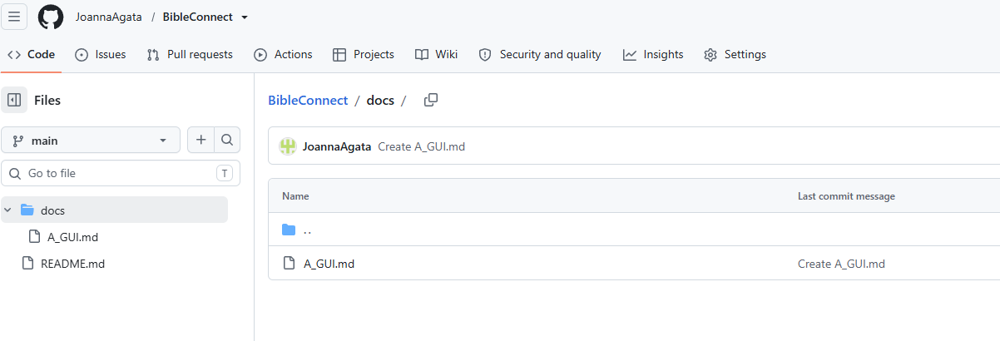
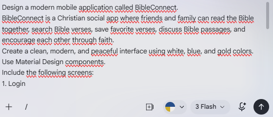
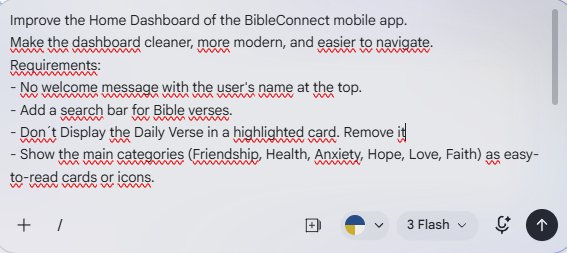
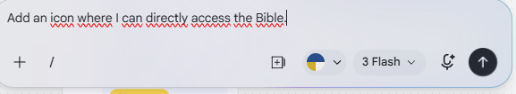
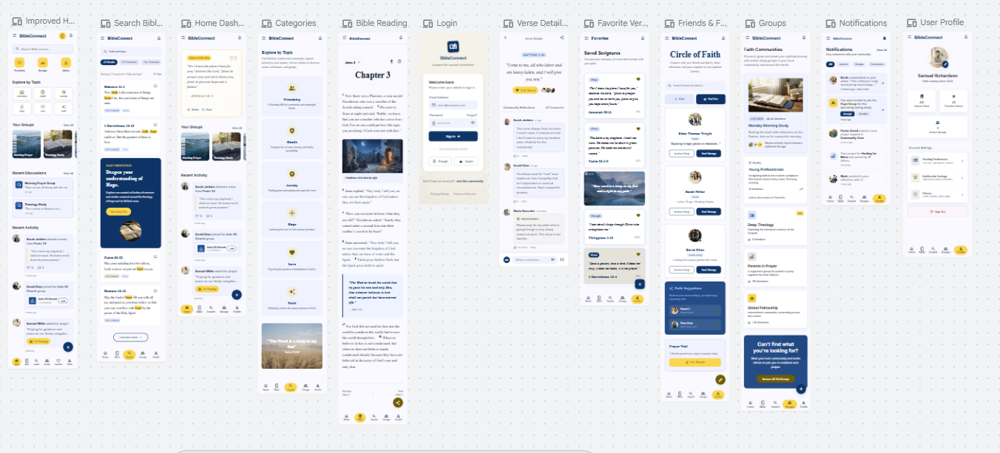

# Aufgabe A – GUI-Entwurf mit Google Stitch

## 1. Ziel der Aufgabe

Ziel dieser Aufgabe war die Erstellung eines grafischen Prototyps für die mobile Anwendung **BibleConnect** mithilfe eines KI-gestützten Designwerkzeugs. Als Werkzeug wurde **Google Stitch** verwendet, um erste Benutzeroberflächen für die geplante Anwendung zu erstellen. Die entstandenen Entwürfe dienen als Grundlage für die weitere Entwicklung des Projekts in den Aufgaben B und C.

## 2. Projektidee

BibleConnect ist eine mobile Anwendung, die Freunden und Familien ermöglicht, gemeinsam die Bibel zu lesen und sich über Bibelverse auszutauschen. Nutzer können Bibelstellen lesen, nach Versen oder Stichwörtern suchen, Verse als Favoriten speichern sowie Kommentare zu einzelnen Bibelstellen verfassen. Darüber hinaus können Gruppen erstellt werden, um gemeinsam über bestimmte Themen zu  diskutieren. Benachrichtigungen informieren die Nutzer über neue Kommentare oder Gruppeneinladungen.

## 3. Verwendetes Werkzeug

Für die Erstellung des grafischen Prototyps wurde **Google Stitch** verwendet. Das KI-gestützte Werkzeug generiert auf Basis von natürlichsprachigen Prompts moderne Benutzeroberflächen und ermöglicht deren schrittweise Verbesserung durch weitere Eingaben.

## 4. Erstellung des GitHub-Repositories

Zu Beginn des Projekts wurde ein öffentliches GitHub-Repository mit dem Namen **BibleConnect** erstellt. Das Repository dient zur Verwaltung der Projektdokumentation, der Screenshots sowie des späteren Quellcodes.

**Abbildung 1:** GitHub-Repository *BibleConnect*

## 5. Erster Entwurf mit Google Stitch

Zur Erstellung des ersten Benutzeroberflächen-Prototyps wurde Google Stitch verwendet. Mithilfe eines detaillierten Prompts wurde die KI angewiesen, eine moderne mobile Anwendung mit den wichtigsten Funktionen von BibleConnect zu entwerfen.

Die erste Version umfasste unter anderem folgende Bereiche:

- Login
- Dashboard
- Bibel lesen
- Kategorien
- Freunde & Gruppen
- Kommentare
- Profil
- Benachrichtigungen

**Abbildung 2:** Erster Prompt in Google Stitch

 

## 6. Verbesserung des Dashboards

Nach der ersten Generierung wurde das Dashboard hinsichtlich Übersichtlichkeit und Benutzerfreundlichkeit verbessert. Ziel war es, die Navigation zu vereinfachen und die wichtigsten Funktionen klarer hervorzuheben. Hierfür wurde ein neuer Prompt in Google Stitch verwendet.

**Abbildung 4:** Prompt zur Verbesserung des Dashboards

**Abbildung 5:** Erneuter Prompt zur Verbesserung des Dashboards

Durch die Anpassung des Prompts wurde das Dashboard übersichtlicher gestaltet. Wichtige Funktionen wie Suche, Favoriten, Gruppen und Benachrichtigungen wurden besser angeordnet. Dadurch wirkt die Benutzeroberfläche insgesamt moderner und benutzerfreundlicher.

**Abbildung 6:** Erste von Google Stitch generierte Benutzeroberflächen

