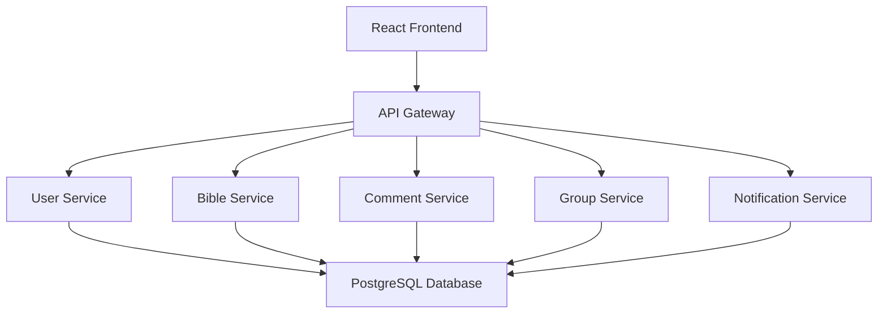

# Systemarchitektur

## 1. Architekturübersicht

BibleConnect wird als verteilte Anwendung (Distributed Application) entwickelt. 
Die Anwendung besteht aus mehreren eigenständigen Services, die jeweils einen klar definierten Aufgabenbereich übernehmen. Die Kommunikation zwischen den Komponenten erfolgt über REST-Schnittstellen.

Durch diese Aufteilung können einzelne Services unabhängig voneinander entwickelt, getestet und erweitert werden. Gleichzeitig erhöht die Architektur die Wartbarkeit und unterstützt eine klare 
Trennung der Verantwortlichkeiten.

## 2. Architekturdiagramm

