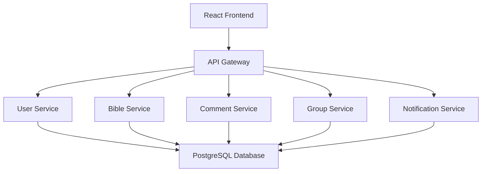

# Systemarchitektur

## 1. Architekturübersicht

BibleConnect wird als verteilte Anwendung (Distributed Application) entwickelt. 
Die Anwendung besteht aus mehreren eigenständigen Services, die jeweils einen klar definierten Aufgabenbereich übernehmen. Die Kommunikation zwischen den Komponenten erfolgt über REST-Schnittstellen.

Durch diese Aufteilung können einzelne Services unabhängig voneinander entwickelt, getestet und erweitert werden. Gleichzeitig erhöht die Architektur die Wartbarkeit und unterstützt eine klare 
Trennung der Verantwortlichkeiten.

## 2. Architekturdiagramm

### Kommunikation zwischen den Services

Die Benutzeroberfläche kommuniziert ausschließlich mit dem API Gateway. Dieses nimmt alle eingehenden Anfragen entgegen und leitet sie an den jeweils zuständigen Service weiter. Jeder Service besitzt einen klar definierten Verantwortungsbereich und verarbeitet ausschließlich die Aufgaben seines Fachgebiets. Dadurch entsteht eine modulare und verteilte Architektur, die einfach erweitert, gewartet und getestet werden kann.

## 3. Komponenten der Architektur

Die Anwendung besteht aus mehreren eigenständigen Komponenten. Jede Komponente übernimmt eine klar definierte Aufgabe innerhalb des Systems.

| Komponente | Aufgabe |
|------------|----------|
| Frontend | Stellt die grafische Benutzeroberfläche bereit und ermöglicht die Interaktion mit der Anwendung. |
| API Gateway | Nimmt Anfragen des Frontends entgegen und leitet sie an den zuständigen Service weiter. |
| User Service | Verwaltet Benutzerkonten, Anmeldung und Benutzerprofile. |
| Bible Service | Stellt Bibeltexte bereit und unterstützt die Suche nach Bibelstellen und Kategorien. |
| Comment Service | Verwaltet Kommentare zu Bibelversen. |
| Group Service | Verwaltet Gruppen sowie Gebetsanliegen innerhalb der Gruppen. |
| Notification Service | Informiert Benutzer über neue Kommentare, Gruppeneinladungen und Gebetsanliegen. |
| PostgreSQL Database | Speichert die Daten der Anwendung dauerhaft. |

## 4. Warum wurde diese Architektur gewählt?

Für BibleConnect wurde eine verteilte Architektur gewählt, da die einzelnen Funktionen der Anwendung unabhängig voneinander entwickelt und betrieben werden können. Jeder Service übernimmt einen klar abgegrenzten Aufgabenbereich und besitzt eine eindeutige Verantwortung.

Durch diese Aufteilung ergeben sich mehrere Vorteile:

- Eine klare Trennung der Verantwortlichkeiten.
- Einzelne Services können unabhängig voneinander erweitert oder geändert werden.
- Fehler in einem Service beeinträchtigen die anderen Services möglichst wenig.
- Neue Funktionen können später einfacher ergänzt werden.
- Die Architektur erfüllt die Anforderungen einer verteilten Softwareanwendung.

Diese Struktur bildet die Grundlage für die Umsetzung in Aufgabe C und ermöglicht eine modulare und wartbare Softwarelösung.
Das Frontend kommuniziert ausschließlich mit dem API Gateway. Dieses leitet die Anfragen an den jeweils zuständigen Service weiter. Jeder Service besitzt einen klar abgegrenzten Verantwortungsbereich und übernimmt nur eine bestimmte Aufgabe innerhalb der Anwendung.

Diese Architektur verbessert die Wartbarkeit, erleichtert zukünftige Erweiterungen und erfüllt die Anforderungen einer verteilten Softwareanwendung.

## 5. Zusammenfassung

Die geplante Systemarchitektur teilt BibleConnect in mehrere unabhängige Services auf. Dadurch entsteht eine modulare und verteilte Anwendung mit klar definierten Verantwortlichkeiten. Diese Architektur dient als Grundlage für die Implementierung des Projekts in Aufgabe C.
