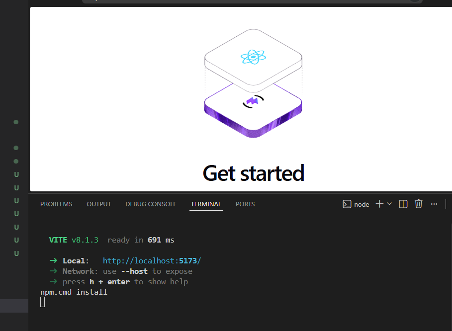

# Step 02 – Frontend erstellen

## Ziel

Ziel dieses Entwicklungsschrittes war die Erstellung des Frontends für die BibleConnect-Anwendung. Als Frontend-Technologie wurde React in Kombination mit Vite verwendet.

## Durchgeführte Arbeiten

- React-Projekt mit Vite erstellt.
- Projektabhängigkeiten installiert.
- Entwicklungsserver gestartet.
- Erfolgreiche Ausführung des Frontends überprüft.

## Verwendete Technologien

- React
- Vite
- Node.js
- npm
- Visual Studio Code

## Ergebnis

Das Frontend wurde erfolgreich erstellt und kann lokal über den Vite-Entwicklungsserver ausgeführt werden. Damit ist die Grundlage für die Entwicklung der Benutzeroberfläche geschaffen.

### Abbildung 1: React-Entwicklungsserver

### Abbildung 2: React-Anwendung im Browser

