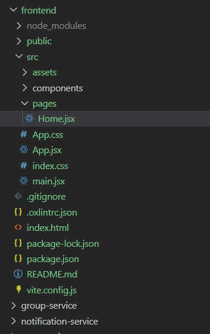
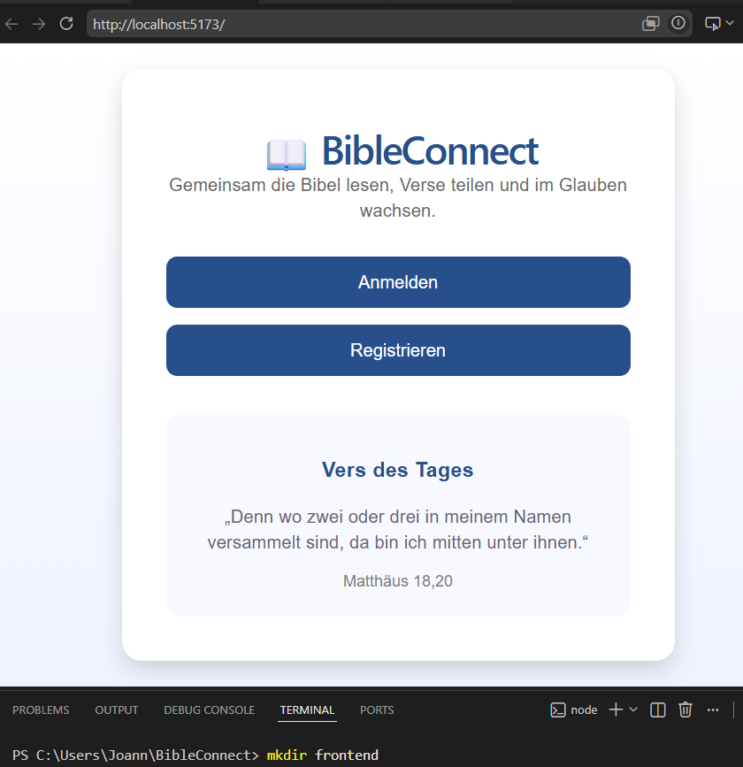

# Step 03 – Entwicklung der ersten BibleConnect-Startseite

## Ziel

Ziel dieses Entwicklungsschrittes war die Umsetzung der ersten eigenen Benutzeroberfläche der Anwendung BibleConnect. Die zuvor angezeigte React-Standardseite wurde durch eine individuell gestaltete Startseite ersetzt.

## Durchgeführte Arbeiten

- React-Projekt strukturiert (Ordner `pages` und `components`).
- Neue Seite `Home.jsx` erstellt.
- `App.jsx` angepasst, sodass die Home-Seite geladen wird.
- Startseite mit Titel, Beschreibung, Buttons und einem Vers des Tages entwickelt.
- Eigenes CSS-Layout zur Gestaltung der Benutzeroberfläche erstellt.

## Ergebnis

Die React-Standardseite wurde erfolgreich durch die erste Version der BibleConnect-Startseite ersetzt. Damit wurde die Grundlage für die weitere Entwicklung der Benutzeroberfläche geschaffen.

### Abbildung 1: Projektstruktur des React-Frontends

### Abbildung 2: Erste Startseite von BibleConnect

