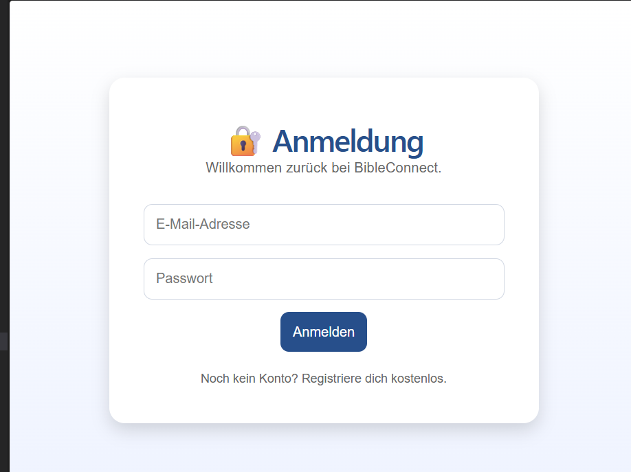

# Step 04 – Entwicklung der Login-Seite

## Ziel

Ziel dieses Entwicklungsschrittes war die Entwicklung der ersten Anmeldeseite für die Anwendung BibleConnect. Benutzer sollen sich zukünftig mit ihrer E-Mail-Adresse und ihrem Passwort anmelden können.

## Durchgeführte Arbeiten

- Neue Seite `Login.jsx` erstellt.
- Eingabefelder für E-Mail-Adresse und Passwort implementiert.
- Anmeldebutton hinzugefügt.
- Eigenes CSS für Eingabefelder und Layout ergänzt.
- Login-Seite in `App.jsx` zum Testen eingebunden.

## Ergebnis

Die erste Login-Seite wurde erfolgreich umgesetzt. Sie bildet die Grundlage für die spätere Benutzeranmeldung sowie die Anbindung an den User-Service.

### Abbildung 1: Login-Seite von BibleConnect

