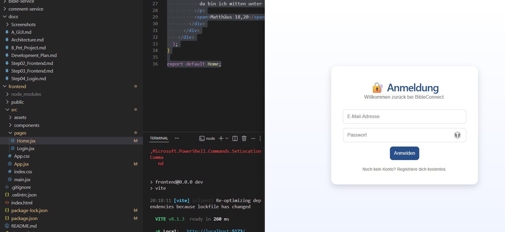

# Step 05 – Einrichtung des Routings

## Ziel

Ziel dieses Entwicklungsschrittes war die Einrichtung einer Navigation zwischen den einzelnen Seiten der Anwendung mithilfe von React Router.

## Durchgeführte Arbeiten

- Bibliothek `react-router-dom` installiert.
- Routing in `App.jsx` eingerichtet.
- Route für die Startseite (`/`) erstellt.
- Route für die Login-Seite (`/login`) erstellt.
- Den Button **„Anmelden“** auf der Startseite mit der Login-Seite verknüpft.

## Ergebnis

Die Navigation zwischen der Startseite und der Login-Seite funktioniert erfolgreich. Damit wurde die Grundlage geschaffen, weitere Seiten wie Registrierung, Dashboard und Benutzerprofil über eigene Routen bereitzustellen.

### Abbildung 1: Einrichtung des React Routers und erfolgreiche Navigation zwischen Startseite und Login-Seite

