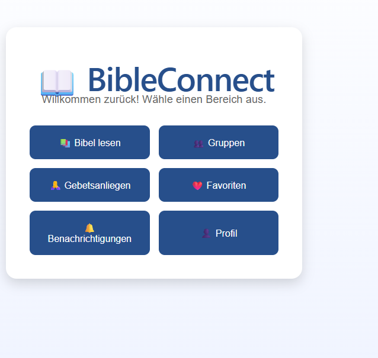

# Step 06 – Entwicklung des Dashboards

## Ziel

Ziel dieses Entwicklungsschrittes war die Entwicklung eines Dashboards als zentrale Startseite nach der Anmeldung. Das Dashboard dient als Einstiegspunkt für die wichtigsten Funktionen der Anwendung BibleConnect.

## Durchgeführte Arbeiten

- Neue Seite `Dashboard.jsx` erstellt.
- Route `/dashboard` mit React Router eingerichtet.
- Navigation von der Login-Seite zum Dashboard umgesetzt.
- Erste Bereiche der Anwendung als Schaltflächen integriert:
  - Bibel lesen
  - Gruppen
  - Gebetsanliegen
  - Favoriten
  - Benachrichtigungen
  - Profil

## Ergebnis

Nach erfolgreicher Anmeldung wird der Benutzer auf das Dashboard weitergeleitet. Das Dashboard bildet die Grundlage für die weitere Entwicklung der Anwendung.

### Abbildung 1: Dashboard der Anwendung BibleConnect

