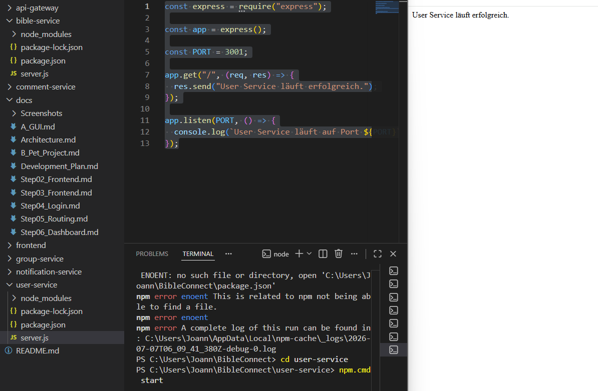

# Step 07 – Entwicklung des User Service

## Ziel

Ziel dieses Entwicklungsschrittes war die Erstellung des ersten eigenständigen Services der verteilten Anwendung BibleConnect. 
Der User Service bildet die Grundlage für die spätere Benutzerverwaltung und zeigt das Prinzip einer verteilten Softwarearchitektur.
=======
Ziel dieses Entwicklungsschrittes war die Entwicklung des ersten eigenständigen Services der verteilten Anwendung BibleConnect. Der User Service bildet die Grundlage für die spätere Benutzerverwaltung.

## Durchgeführte Arbeiten

- Eigenen Ordner `user-service` eingerichtet.
<<<<<<< HEAD
- Node.js-Projekt mit `npm init` erstellt.
- Express installiert.
- Datei `server.js` erstellt.
- HTTP-Endpunkt `/` implementiert.
- Service auf Port **3001** gestartet und getestet.

## Ergebnis

Der User Service läuft unabhängig vom Frontend als eigener Prozess auf Port **3001**. Damit wurde der erste Baustein der verteilten Architektur erfolgreich umgesetzt.

### Abbildung 1: Laufender User Service

=======
- Node.js-Projekt erstellt.
- Express installiert.
- Datei `server.js` erstellt.
- HTTP-Endpunkt implementiert.
- Service auf Port **3001** gestartet und getestet.

## Bedeutung für die verteilte Architektur

Der User Service ist ein eigenständiger Prozess und läuft unabhängig vom Frontend. Er übernimmt ausschließlich Aufgaben der Benutzerverwaltung. Später kommuniziert das Frontend über HTTP mit diesem Service. Dadurch wird das Prinzip einer verteilten Softwarearchitektur umgesetzt.

## Ergebnis

Der User Service wurde erfolgreich implementiert und getestet.

### Abbildung 1: Laufender User Service

