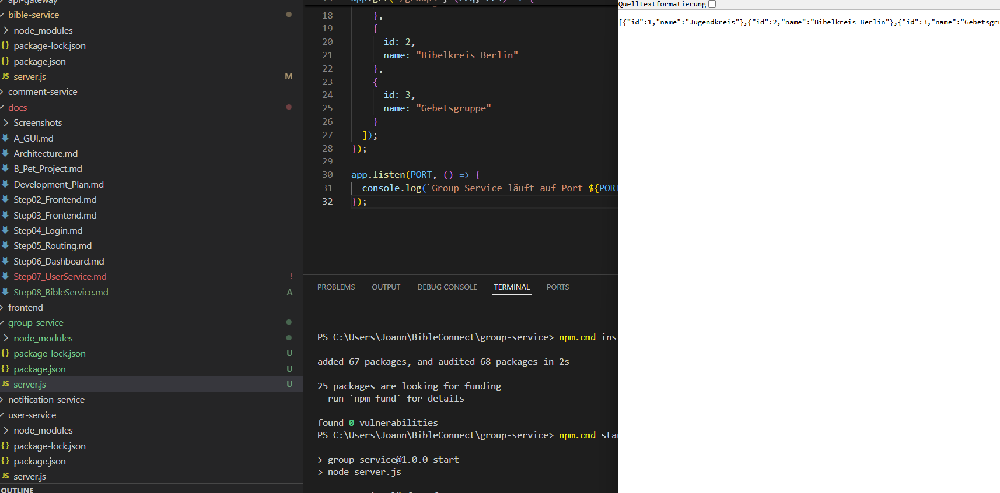

# Step 09 – Entwicklung des Group Service

## Ziel

Ziel dieses Entwicklungsschrittes war die Entwicklung des Group Service. Dieser Service verwaltet später alle Gruppen innerhalb der Anwendung BibleConnect und stellt Informationen zu Bibelgruppen bereit.

## Durchgeführte Arbeiten

- Eigenen Service eingerichtet.
- Node.js-Projekt erstellt.
- Express installiert.
- Datei `server.js` erstellt.
- Service auf Port **3003** gestartet.
- REST-Endpunkte `/` und `/groups` implementiert.

## Bedeutung für die verteilte Architektur

Der Group Service ist ein eigenständiger Prozess und übernimmt ausschließlich die Verwaltung von Gruppen. Dadurch bleibt die Anwendung modular aufgebaut und einzelne Services können unabhängig voneinander entwickelt, getestet und erweitert werden.

## Ergebnis

Der Group Service wurde erfolgreich implementiert und getestet. Über den Endpunkt `/groups` werden beispielhaft vorhandene Gruppen im JSON-Format bereitgestellt.

### Abbildung 1: Laufender Group Service

