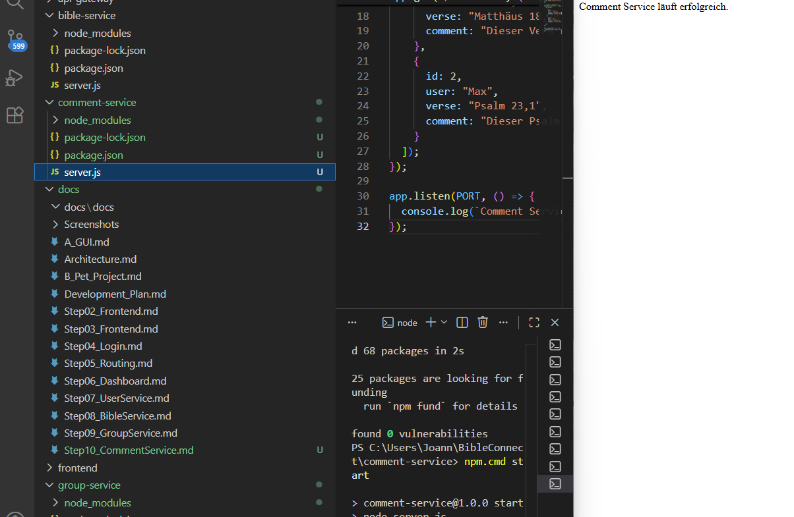

# Step 10 – Entwicklung des Comment Service

## Ziel

Ziel dieses Entwicklungsschrittes war die Entwicklung des Comment Service. Dieser Service verwaltet später Kommentare zu Bibelversen und ermöglicht den Austausch zwischen den Benutzern.

## Durchgeführte Arbeiten

- Eigenen Service eingerichtet.
- Node.js-Projekt erstellt.
- Express installiert.
- Datei `server.js` erstellt.
- Service auf Port **3004** gestartet.
- REST-Endpunkte `/` und `/comments` implementiert.

## Bedeutung für die verteilte Architektur

Der Comment Service ist ein eigenständiger Prozess und übernimmt ausschließlich die Verwaltung von Kommentaren. Dadurch werden Kommentare unabhängig von den übrigen Funktionen der Anwendung verarbeitet und bereitgestellt.

## Ergebnis

Der Comment Service wurde erfolgreich implementiert und getestet. Über den Endpunkt `/comments` werden beispielhafte Kommentare im JSON-Format bereitgestellt.

### Abbildung 1: Laufender Comment Service

