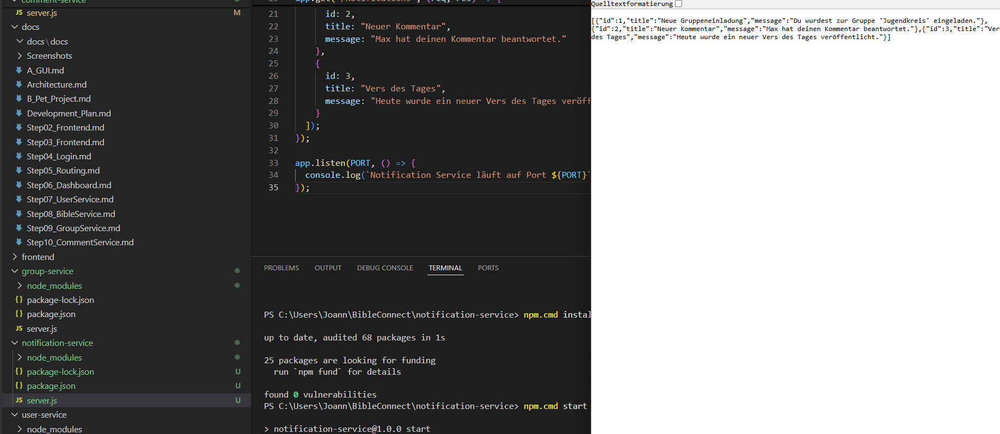

# Step 11 – Entwicklung des Notification Service

## Ziel

Ziel dieses Entwicklungsschrittes war die Entwicklung des Notification Service. Dieser Service verwaltet später alle Benachrichtigungen innerhalb der Anwendung BibleConnect.

## Durchgeführte Arbeiten

- Eigenen Service eingerichtet.
- Node.js-Projekt erstellt.
- Express installiert.
- Datei `server.js` erstellt.
- Service auf Port **3005** gestartet.
- REST-Endpunkte `/` und `/notifications` implementiert.

## Bedeutung für die verteilte Architektur

Der Notification Service ist ein eigenständiger Prozess und übernimmt ausschließlich die Verwaltung von Benachrichtigungen. Dadurch können andere Services Ereignisse an den Notification Service weitergeben, ohne selbst Benachrichtigungen verwalten zu müssen.

## Ergebnis

Der Notification Service wurde erfolgreich implementiert und getestet. Über den Endpunkt `/notifications` werden beispielhafte Benachrichtigungen im JSON-Format bereitgestellt.

### Abbildung 1: Laufender Notification Service

