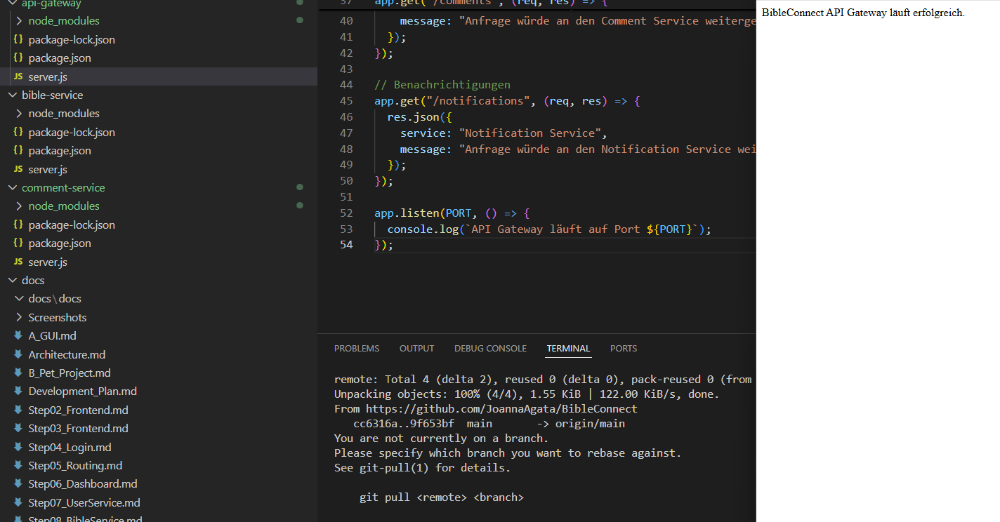

# Step 12 – Entwicklung des API Gateway

## Ziel

Ziel dieses Entwicklungsschrittes war die Entwicklung eines zentralen API Gateways für die verteilte Anwendung BibleConnect. Das API Gateway dient als zentraler Einstiegspunkt für das Frontend und stellt die Verbindung zu den einzelnen Services her.

## Durchgeführte Arbeiten

- Eigenen Ordner `api-gateway` eingerichtet.
- Node.js-Projekt erstellt.
- Express installiert.
- Datei `server.js` erstellt.
- Service auf Port **3000** gestartet.
- REST-Endpunkte für die einzelnen Services implementiert:
  - `/users`
  - `/verse`
  - `/groups`
  - `/comments`
  - `/notifications`

## Bedeutung für die verteilte Architektur

Das API Gateway bildet den zentralen Einstiegspunkt der Anwendung. Anstatt dass das Frontend direkt mit allen Services kommuniziert, werden Anfragen zunächst an das API Gateway gesendet. Dieses entscheidet, welcher Service für die Verarbeitung zuständig ist und leitet die Anfrage entsprechend weiter. Dadurch bleibt die Architektur übersichtlich, modular und leicht erweiterbar.

## Ergebnis

Das API Gateway wurde erfolgreich implementiert und getestet. Die einzelnen Endpunkte liefern beispielhafte Antworten und verdeutlichen die spätere Kommunikation zwischen Frontend und den einzelnen Services.

### Abbildung 1: Laufendes API Gateway

